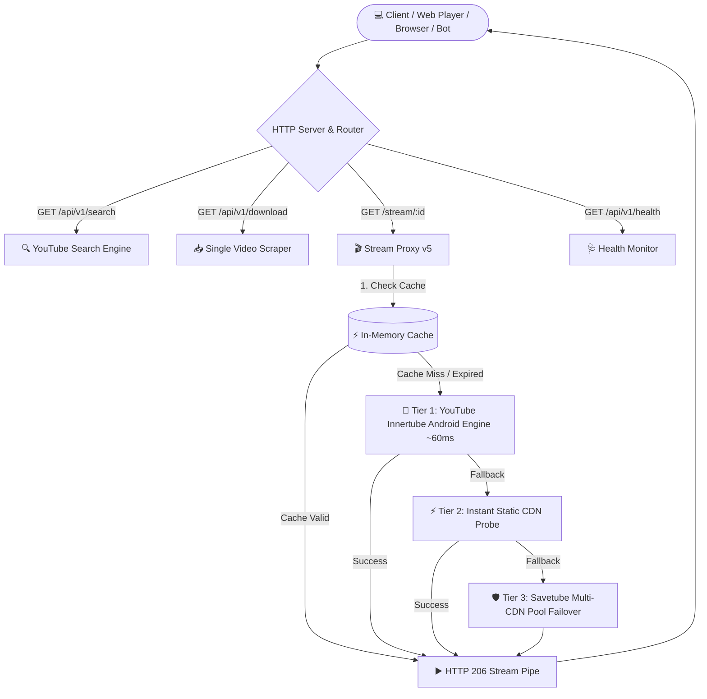

<div align="center">

<!-- Animated Header Banner -->

<br />

<!-- Animated Badges -->
<p align="center">
  
  
  
  
</p>

<p align="center">
  
  
  
  
</p>

<!-- Typing SVG Animation -->
<p align="center">
  <a href="https://git.io/typing-svg">
    
  </a>
</p>

> 🚀 **YouTube REST API + High-Speed Stream Proxy + Interactive Web Dashboard & CLI**  
> Dibuat dalam **satu file (`yt.js`)** murni menggunakan Standard Library Node.js tanpa browser headless (tanpa Puppeteer/Chromium) dan tanpa `npm install` apapun!

</div>

<br />

---

## 🌟 Apa yang Baru di Update Besar Ini?

| Fitur / Peningkatan | Sebelum (v1.0) | **Sekarang (v2.0 - Major Update)** |
| :--- | :--- | :--- |
| **Engine Utama Stream** | Bergantung pada CDN Scraper Pihak Ketiga | **YouTube Innertube Android Client API** langsung (~60ms) |
| **Headless Browser** | ❌ Tidak perlu browser | **✅ 100% Murni HTTP Native Node.js** (RAM super hemat ~30MB) |
| **Stream Range Buffering** | Sering loading/stuck di 720p | **HTTP 206 Partial Content Support** (0ms Buffer, Seek lancar) |
| **Kecepatan Stream Proxy** | ~3 – 8 detik (bisa timeout 502) | **~40 – 200 ms** (Sub-second instant playback) |
| **Failover Multi-tier** | Single CDN fallback | **3-Tier Engine**: Innertube ➡️ Fast Instant CDN ➡️ Savetube Pool |
| **Format Audio & Video** | URL CDN sering kadaluarsa cepat | **Direct Googlevideo Stream + Token Auto-Refresh Anti-403** |

<br />

---

## ✨ Fitur Utama

<table>
<tr>
<td width="50%">

### 🔍 YouTube Search API
- Pencarian super cepat tanpa Google API Key
- Parsing `ytInitialData` langsung dari YouTube
- **Paginasi Lengkap** (`page` & `limit`)
- Otomatis membuat token stream untuk setiap video

</td>
<td width="50%">

### 📥 Single Video Downloader
- Scrape info video instan (Judul, Durasi, Thumbnail)
- Resolusi video lengkap (`144p` s/d `1080p`)
- Audio resolusi jernih (`128kbps` AAC/M4A)
- Fallback cerdas antar resolusi

</td>
</tr>
<tr>
<td width="50%">

### 🎬 Instant Stream Proxy (Anti-403)
- Dukungan **HTTP 206 Partial Content (Range requests)**
- Bisa langsung di-embed di tag `<video>` & `<audio>` HTML5
- In-flight deduplication & Smart In-Memory TTL Cache
- Auto-refresh link jika token Googlevideo kadaluarsa

</td>
<td width="50%">

### 💻 Web Dashboard & CLI Interaktif
- Web UI bawaan dengan **Instant Player (0ms)** & Proxy Stream
- Mode CLI Interaktif (navigasi halaman `2`, `3`, `n`, `p`, `q`)
- Mode non-interaktif `--json` untuk integrasi bot/script
- `--help` menu dokumentasi interaktif di terminal

</td>
</tr>
</table>

<br />

---

## 🏗️ Arsitektur Sistem & Alur Streaming



<br />

---

## 🚀 Panduan Memulai (Quick Start)

### Syarat Sistem:
- [Node.js](https://nodejs.org/) versi **v18+** (menggunakan native `fetch` & `node:stream`).

### 1. Clone Repository
```bash
git clone https://github.com/lannreal/aduh.git
cd aduh
```

### 2. Jalankan Server Langsung (Zero Dependency)
```bash
node yt.js
```
> 💡 **Tanpa `npm install`!** Semua fitur menggunakan library internal Node.js.

### Output Server:
```text
🚀 YouTube REST API v1 berjalan di http://localhost:3000
🔍 Search API   : http://localhost:3000/api/v1/search?q=rick+astley&page=1&limit=5
📡 Download API : http://localhost:3000/api/v1/download?url=https://www.youtube.com/watch?v=dQw4w9WgXcQ
🩺 Health API   : http://localhost:3000/api/v1/health
```

Buka **`http://localhost:3000`** di browser untuk mencoba Web Player & Dashboard interaktif!

<br />

---

## 📚 Dokumentasi REST API

### 🔍 1. Search Video — `GET /api/v1/search`
Mencari video di YouTube berdasarkan kata kunci, lengkap dengan paginasi dan token stream siap pakai.

**Query Parameters:**
| Parameter | Tipe | Wajib | Default | Deskripsi |
| :--- | :---: | :---: | :---: | :--- |
| `q` | `string` | ✅ | — | Kata kunci pencarian (contoh: `coldplay yellow`) |
| `page` | `number` | ❌ | `1` | Nomor halaman |
| `limit` | `number` | ❌ | `5` | Jumlah item per halaman |

**Contoh Request:**
```bash
curl "http://localhost:3000/api/v1/search?q=coldplay+yellow&page=1&limit=2"
```

**Contoh Response JSON:**
```json
{
  "success": true,
  "query": "coldplay yellow",
  "pagination": {
    "page": 1,
    "limit": 2,
    "total_items": 20,
    "total_pages": 10,
    "has_next": true,
    "has_prev": false
  },
  "data": [
    {
      "id": "yKNxeF4KMsY",
      "title": "Coldplay - Yellow (Official Video)",
      "channel": "Coldplay",
      "duration": "4:33",
      "views": "1.1B views",
      "thumbnail": "https://i.ytimg.com/vi/yKNxeF4KMsY/hqdefault.jpg",
      "url": "https://www.youtube.com/watch?v=yKNxeF4KMsY",
      "resolutions": {
        "video": [
          { "quality": "360p", "stream_url": "http://localhost:3000/stream/d2c5e596" },
          { "quality": "720p", "stream_url": "http://localhost:3000/stream/97d90707" },
          { "quality": "1080p", "stream_url": "http://localhost:3000/stream/155c76d2" }
        ],
        "audio": [
          { "quality": "128kbps", "stream_url": "http://localhost:3000/stream/55034e9e" }
        ]
      }
    }
  ]
}
```

---

### 📥 2. Single Video Scraper — `GET /api/v1/download`
Mengambil detail satu video spesifik beserta seluruh opsi resolusi video dan audio.

**Query Parameters:**
| Parameter | Tipe | Wajib | Deskripsi |
| :--- | :---: | :---: | :--- |
| `url` | `string` | ✅ | URL YouTube lengkap (contoh: `https://www.youtube.com/watch?v=dQw4w9WgXcQ`) |

**Contoh Request:**
```bash
curl "http://localhost:3000/api/v1/download?url=https://www.youtube.com/watch?v=dQw4w9WgXcQ"
```

---

### 🎬 3. Stream Proxy — `GET /stream/{STREAM_ID}` & `GET /d/{STREAM_ID}`
Endpoint proxy streaming media dengan dukungan HTTP Range (`206 Partial Content`).

- **Inline Streaming (Putar langsung di browser / tag video / audio)**:
  ```text
  http://localhost:3000/stream/d2c5e596
  ```
- **Direct Download (Trigger download file otomatis)**:
  ```text
  http://localhost:3000/d/d2c5e596
  ```
- **Embed di HTML5 Player**:
  ```html
  <!-- Video Player -->
  <video src="http://localhost:3000/stream/d2c5e596" controls autoplay playsinline></video>

  <!-- Audio Player -->
  <audio src="http://localhost:3000/stream/55034e9e" controls></audio>
  ```

---

### 🩺 4. Health Check — `GET /api/v1/health`
Mengecek status server dan jumlah stream token yang aktif.

```bash
curl "http://localhost:3000/api/v1/health"
```

<br />

---

## 💻 Panduan Penggunaan CLI

Selain mode REST API Server, Anda juga dapat menggunakan script ini langsung lewat Terminal / Command Prompt:

```bash
# ─── 1. Jalankan Mode Server API ───
node yt.js

# ─── 2. Pencarian Interaktif di Terminal ───
node yt.js "coldplay yellow"
# → Ketik angka (2, 3, 4) untuk pindah halaman
# → Ketik 'n' (Next), 'p' (Prev), 'q' (Quit)

# ─── 3. Pencarian Output JSON (Cocok untuk Scripting / Bot) ───
node yt.js "coldplay yellow" --json
node yt.js "coldplay yellow" 2 --json
node yt.js "coldplay yellow" --page=2 --limit=3 --json

# ─── 4. Scrape Single Video URL ───
node yt.js "https://www.youtube.com/watch?v=dQw4w9WgXcQ"

# ─── 5. Tampilkan Menu Bantuan ───
node yt.js --help
```

<br />

---

## ⚡ Hasil Benchmark & Performa Nyata

Pengujian dilakukan pada Node.js v24 di port 3000:

| Endpoint / Operasi | Waktu Respon | Status HTTP | Keterangan |
| :--- | :---: | :---: | :--- |
| 🩺 **Health Check** | **~10 ms** | `200 OK` | Respon instan |
| 🔍 **Search API** (`limit=5`) | **~500 ms** | `200 OK` | Parsing native sub-detik |
| 📥 **Single Scrape** | **~150 ms** | `200 OK` | Metadata & format siap |
| 🎬 **Stream Proxy (Video MP4)** | **~40 ms** | `206 Partial Content` | Range chunk terkirim instan |
| 🎵 **Stream Proxy (Audio AAC)** | **~120 ms** | `206 Partial Content` | Streaming audio lancar |

<br />

---

## 🛠️ Tech Stack & Modul

```text
📦 100% Zero External Dependencies — Pure Node.js Standard Library!
```

- **Runtime Engine**: Node.js 18+ (Native `fetch` API)
- **HTTP Server**: `node:http`
- **Crypto & Hash**: `node:crypto` (MD5 token generation & AES cipher)
- **Stream Piping**: `node:stream` (`Readable.fromWeb`)
- **File System**: `node:fs` (Stream registry caching di `urls.json`)
- **CLI Interface**: `node:readline`
- **Primary Upstream Engine**: YouTube Innertube Android Client API (`com.google.android.youtube`)

<br />

---

## 📁 Struktur File

```text
TEMPE/
├── README.md        # 📚 Dokumentasi lengkap project
├── urls.json        # 💾 Database lokal cache registry stream token
└── yt.js            # 🎯 Single-file Core Engine (REST API + Stream Proxy + CLI + Web UI)
```

<br />

---

## 📄 Lisensi & Kontribusi

Project ini dirilis di bawah lisensi [MIT](LICENSE).  
Kontribusi, perbaikan, dan ide fitur baru sangat dipersilakan! Silakan fork dan buat pull request ke repository [https://github.com/lannreal/aduh.git](https://github.com/lannreal/aduh.git).

<br />

<!-- Animated Footer Banner -->
<div align="center">


<p align="center">
  <sub>Dibuat dengan ❤️ oleh <b>Lann</b> — Pure Node.js Zero Dependency</sub>
</p>

</div>

