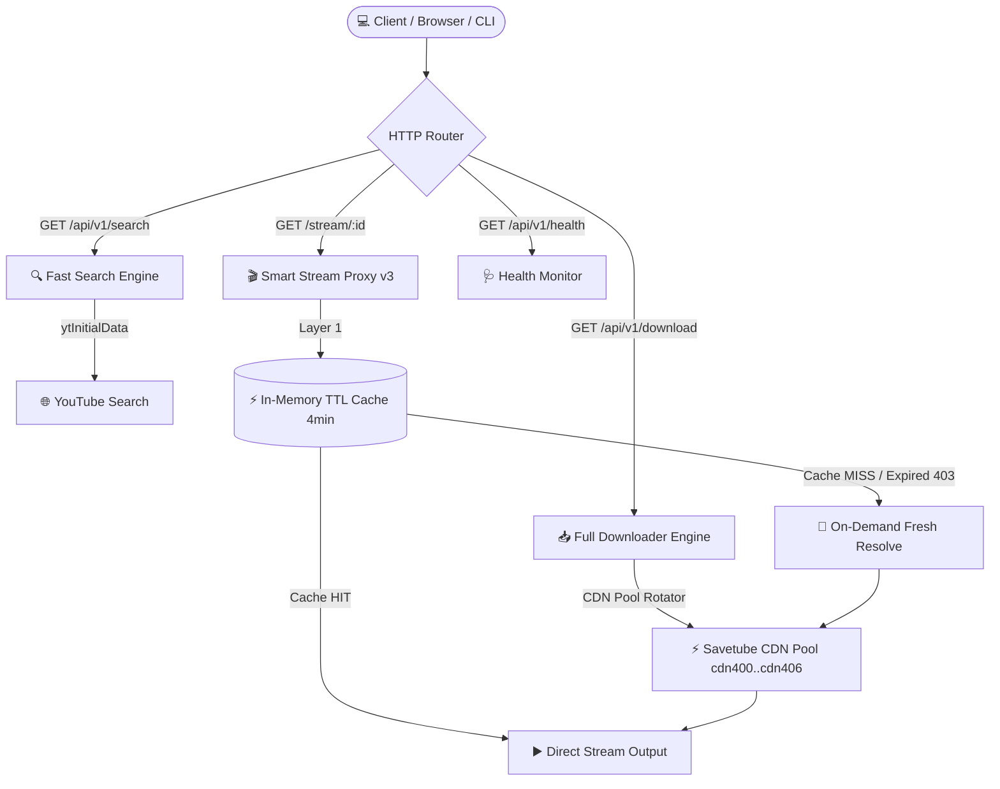
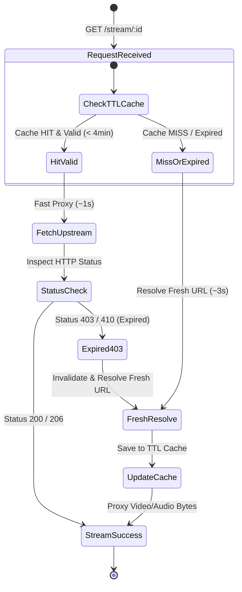

<div align="center">

<!-- Animated Header Banner -->


<br />

<!-- Animated Badges -->
<p align="center">
  
  
  
  
</p>

<p align="center">
  
  
  
  
</p>

<!-- Typing SVG Animation -->
<p align="center">
  <a href="https://git.io/typing-svg">
    
  </a>
</p>

> **YouTube REST API + Stream Proxy + Interactive CLI**  
> dalam **satu file** tanpa dependensi eksternal apapun.

</div>

<br />

---

## ✨ Fitur Utama

<table>
<tr>
<td width="50%">

### 🔍 YouTube Search
- Pencarian video native tanpa API Key
- Parsing `ytInitialData` langsung dari YouTube
- **Paginated** — max 5 hasil per halaman
- Navigasi halaman otomatis

</td>
<td width="50%">

### 📥 Video Downloader
- Scrape info video lengkap (judul, durasi, thumbnail)
- **8 resolusi video** (144p → 4K)
- Format audio MP3 (128kbps)
- CDN Pool Failover (anti rate-limit)

</td>
</tr>
<tr>
<td width="50%">

### 🎬 Stream Proxy
- Anti-403 dengan header spoofing
- **Smart TTL Cache** (4 menit)
- Lazy URL resolution (on-demand)
- Bisa embed di `<video>` tag

</td>
<td width="50%">

### 💻 Interactive CLI
- Auto-detect: URL vs search query
- Terminal prompt interaktif (ketik `2`, `3`, `n`, `p`, `q`)
- `--json` flag untuk scripting/bot
- `--help` panduan lengkap

</td>
</tr>
</table>

<br />

---

## 🏗️ Arsitektur & Alur Kerja

<details open>
<summary><b>📐 Diagram Arsitektur System</b></summary>

<br />



</details>

<br />

<details>
<summary><b>🔄 Stream Proxy v3 — 3-Layer Cache Flow</b></summary>

<br />



</details>

<br />

---

## 🚀 Quick Start

### Prerequisites

- [Node.js](https://nodejs.org/) **v18+** (menggunakan native `fetch` & `stream/promises`)

### Instalasi & Menjalankan

```bash
# 1. Clone repository
git clone https://github.com/lannreal/aduh.git
cd aduh

# 2. Jalankan (Zero Dependencies — Tanpa npm install!)
node yt.js
```

> **💡 Tidak ada `npm install`** — project ini menggunakan 100% Node.js built-in modules.

### Output Server Running:

```text
🚀 YouTube REST API v1 berjalan di http://localhost:3000
🔍 Search API   : http://localhost:3000/api/v1/search?q=rick+astley&page=1&limit=5
📡 Download API : http://localhost:3000/api/v1/download?url=https://www.youtube.com/watch?v=dQw4w9WgXcQ
🩺 Health API   : http://localhost:3000/api/v1/health
```

<br />

---

## 📚 API Endpoints

<details open>
<summary><h3>🔍 1. Search — <code>GET /api/v1/search</code></h3></summary>

Cari video YouTube dengan pagination. Response cepat (~2 detik) karena menggunakan **Fast Mode**.

**Query Parameters:**

| Parameter | Wajib | Default | Keterangan |
|-----------|:-----:|:-------:|------------|
| `q` | ✅ | — | Kata kunci pencarian |
| `page` | ❌ | `1` | Nomor halaman |
| `limit` | ❌ | `5` | Maks item per halaman |

**Request Example:**
```bash
curl "http://localhost:3000/api/v1/search?q=rick+astley&page=1&limit=5"
```

**Response JSON:**
```json
{
  "success": true,
  "query": "rick astley",
  "pagination": {
    "page": 1,
    "limit": 5,
    "total_items": 20,
    "total_pages": 4,
    "has_next": true,
    "has_prev": false,
    "next_page_url": "http://localhost:3000/api/v1/search?q=rick+astley&page=2&limit=5"
  },
  "data": [
    {
      "id": "dQw4w9WgXcQ",
      "title": "Rick Astley - Never Gonna Give You Up",
      "channel": "Rick Astley",
      "duration": "3:33",
      "views": "1.5B views",
      "thumbnail": "https://i.ytimg.com/vi/dQw4w9WgXcQ/hqdefault.jpg",
      "url": "https://www.youtube.com/watch?v=dQw4w9WgXcQ",
      "resolutions": {
        "video": [
          { "quality": "360p", "stream_url": "http://localhost:3000/stream/1ed99905" }
        ],
        "audio": [
          { "quality": "128kbps", "stream_url": "http://localhost:3000/stream/76d56d56" }
        ]
      }
    }
  ]
}
```

> 💡 **Search menggunakan Fast Mode** — hanya menyediakan `stream_url` (tanpa `direct_url`) agar response tetap cepat. Gunakan `/api/v1/download` jika butuh `direct_url`.

</details>

<details>
<summary><h3>📥 2. Download — <code>GET /api/v1/download</code></h3></summary>

Ambil info lengkap 1 video termasuk **semua resolusi** (144p - 4K) dan link download langsung.

**Query Parameters:**

| Parameter | Wajib | Keterangan |
|-----------|:-----:|------------|
| `url` | ✅ | URL YouTube lengkap |

**Request Example:**
```bash
curl "http://localhost:3000/api/v1/download?url=https://www.youtube.com/watch?v=dQw4w9WgXcQ"
```

**Response JSON:**
```json
{
  "success": true,
  "data": {
    "id": "dQw4w9WgXcQ",
    "title": "Rick Astley - Never Gonna Give You Up",
    "duration": "3:33",
    "thumbnail": "https://i.ytimg.com/vi/dQw4w9WgXcQ/maxresdefault.jpg",
    "resolutions": {
      "video": [
        {
          "quality": "360p",
          "stream_url": "http://localhost:3000/stream/1ed99905",
          "direct_url": "https://rr2---.googlevideo.com/videoplayback?..."
        },
        { "quality": "720p",  "stream_url": "...", "direct_url": "..." },
        { "quality": "1080p", "stream_url": "...", "direct_url": "..." },
        { "quality": "2160p", "stream_url": "...", "direct_url": "..." }
      ],
      "audio": [
        {
          "quality": "128kbps",
          "stream_url": "http://localhost:3000/stream/76d56d56",
          "direct_url": "https://cdn405.savetube.vip/media/..."
        }
      ]
    }
  }
}
```

</details>

<details>
<summary><h3>🎬 3. Stream Proxy — <code>GET /stream/:id</code></h3></summary>

Proxy streaming yang aman. Buka di browser → video/audio langsung diputar.

**Request Example:**
```bash
# Akses langsung dari browser
http://localhost:3000/stream/1ed99905

# Embed di HTML5 player
<video src="http://localhost:3000/stream/1ed99905" controls></video>
```

**Fitur Proxy:**
- ✅ **Anti-403** — header YouTube spoofing otomatis (`Referer` & `Origin`)
- ✅ **Smart Cache** — akses pertama ~3s, akses berikutnya ~1s (instant)
- ✅ **Auto-refresh** — URL expired? otomatis resolve token baru
- ✅ **Range requests** — mendukung seeking/skipping video
- ✅ **CORS enabled** — bisa dipanggil dari web frontend manapun

</details>

<details>
<summary><h3>🩺 4. Health Check — <code>GET /api/v1/health</code></h3></summary>

Cek status kesehatan server.

**Request Example:**
```bash
curl http://localhost:3000/api/v1/health
```

**Response JSON:**
```json
{
  "success": true,
  "message": "YouTube API v1 is active and running smoothly",
  "uptime_seconds": 360,
  "active_streams": 28
}
```

</details>

<br />

---

## 💻 CLI Mode

<details open>
<summary><b>Terminal Interactive Commands</b></summary>

<br />

```bash
# ─── 1. Server Mode ───
node yt.js
node yt.js --server

# ─── 2. Interactive Terminal Search ───
node yt.js "rick astley"
# → Ketik angka (2, 3, 4) untuk pindah halaman
# → Ketik 'n' (next), 'p' (prev), 'q' (quit)

# ─── 3. Non-Interactive Search (JSON output) ───
node yt.js "rick astley" --json
node yt.js "rick astley" 2 --json
node yt.js "rick astley" --page=3 --limit=2

# ─── 4. Single Video Downloader CLI ───
node yt.js "https://www.youtube.com/watch?v=dQw4w9WgXcQ"

# ─── 5. CLI Help Menu ───
node yt.js --help
```

</details>

<br />

---

## ⚡ Performa & Benchmarks

<table>
<thead>
<tr>
<th>Operasi</th>
<th>Waktu Response</th>
<th>Status</th>
</tr>
</thead>
<tbody>
<tr>
<td>🔍 <b>Search API</b> (5 items)</td>
<td><b>~2.4 detik</b></td>
<td>⚡ 10x lebih cepat (Fast Mode)</td>
</tr>
<tr>
<td>📥 <b>Download API</b> (1 video)</td>
<td><b>~5.7 detik</b></td>
<td>📦 Full Scrape (8 video + audio)</td>
</tr>
<tr>
<td>🎬 <b>Stream #1</b> (First Access)</td>
<td><b>~3-5 detik</b></td>
<td>🔄 On-Demand Lazy Resolve</td>
</tr>
<tr>
<td>⚡ <b>Stream #2</b> (Cache HIT)</td>
<td><b>~1.0 detik</b></td>
<td>🚀 Instant dari TTL Cache</td>
</tr>
<tr>
<td>🩺 <b>Health Check</b></td>
<td><b>< 10ms</b></td>
<td>⚡ Instant Response</td>
</tr>
</tbody>
</table>

<br />

---

## 🛠️ Tech Stack

```text
📦 Zero External Dependencies! Pure Node.js Standard Library.
```

| Komponen | Teknologi |
|----------|-----------|
| Runtime | Node.js 18+ (native `fetch`) |
| HTTP Web Server | `node:http` |
| Encryption | `node:crypto` (AES-128-CBC) |
| Streaming Engine | `node:stream` + `pipeline` |
| File Persistence | `node:fs` |
| CLI Interface | `node:readline` |
| Parser Engine | Native `ytInitialData` regex parser |

<br />

---

## 📁 Struktur Project

```text
TEMPE/
├── .gitignore       # 🙈 Custom ignore file
├── README.md        # 📚 Dokumentasi lengkap
└── yt.js            # 🎯 Single-File Engine (API + Stream Proxy + CLI)
```

<br />

<!-- Animated Footer Banner -->
<div align="center">


<p align="center">
  <sub>Built with ❤️ using pure Node.js — Zero Dependencies</sub>
</p>

</div>
